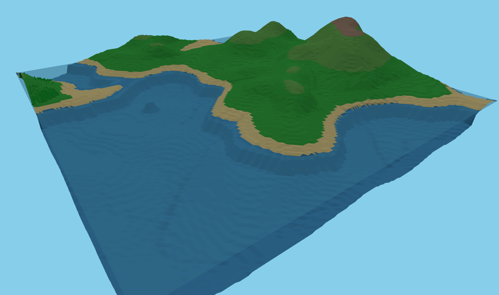

# Map Gen RTS - Low-Poly Terrain Generator

A real-time strategy style terrain generator with low-poly aesthetics, deterministic generation, and customizable features.



## Features

### 🎯 **Deterministic Generation**
- Same seed produces identical maps every time
- Independent random streams for terrain, lakes, and trees
- Reproducible for debugging and multiplayer

### 🗺️ **Low-Poly Style**
- Faceted terrain with discrete height levels
- Vibrant color bands (beaches, grass, hills, rock, snow)
- Instanced tree meshes for performance

### 🌊 **Smart Water System**
- Exact water coverage percentages
- Natural lake placement with organic shorelines
- Water plane with subtle wave animation

### 🌳 **Forest Placement**
- Trees only on suitable terrain (green areas, not water/beaches)
- Even distribution across the map
- Configurable density and spacing

### 🎮 **Camera Controls**
- Multiple modes: Top-down, Diagonal, Landscape
- Mouse drag rotation (360°)
- Zoom with limits
- Fog toggle

## Quick Start

1. **Clone & Install**
   ```bash
   git clone <repository>
   cd mapgenRTS
   npm install
   ```

2. **Run Development Server**
   ```bash
   npm run dev
   ```
   Open http://localhost:5174

3. **Generate Maps**
   - Adjust sliders for water %, forest %, elevation scale
   - Click "Regenerate Map" for new terrain
   - Use "Random Seed" for variety

## Controls

### **Terrain Parameters**
- **Seed**: Integer seed for deterministic generation
- **Map Size**: Width/height in cells (affects detail)
- **Water Coverage %**: Exact percentage of map covered by water
- **Forest Coverage %**: Percentage of suitable land with trees
- **Elevation Scale**: Height multiplier in meters

### **Camera**
- **Mode**: Top-down / Diagonal / Landscape
- **Angle**: Camera tilt (diagonal/landscape modes)
- **Zoom**: 0.3x to 8.0x with mouse wheel
- **Rotation**: Mouse drag or slider (360°)

### **Visual Options**
- **Guide Mode**: Low-poly plane geometry (recommended)
- **Low-Poly Mode**: Flat shading and color bands
- **Show Water**: Toggle water plane
- **Show Grid**: Wireframe overlay
- **Show Fog**: Atmospheric fog effect

## Technical Architecture

### **Generation Pipeline**
1. **Multi-band noise** (macro continents + meso ranges + micro detail)
2. **Elevation curve** (designer presets for terrain shaping)
3. **Lake placement** (Poisson disk sampling for even distribution)
4. **Erosion simulation** (hydraulic + thermal for realistic valleys)
5. **Sea level solving** (quantile method for exact water %)
6. **Biome classification** (temperature/moisture grids)
7. **Mesh building** (quantized heights, dynamic color bands)

### **Performance Optimizations**
- Instanced meshes for trees (1 draw call per type)
- Efficient noise generation with typed arrays
- Triangle budget control for consistent FPS
- WebGL2 for hardware acceleration

## File Structure

```
src/
├── main.js              # App initialization and UI
├── config.js            # Generation parameters
├── renderer.js          # Three.js scene management
├── terrainGenerator.js  # Legacy terrain pipeline
├── noise.js             # Simplex noise implementation
├── erosion.js           # Hydraulic/thermal erosion
├── biomes.js            # Biome classification
└── materials.js         # Shader materials
```

## Development

### **Adding New Features**
1. Update `config.js` with new parameters
2. Modify generation pipeline in `terrainGenerator.js`
3. Update renderer in `renderer.js` for visuals
4. Add UI controls in `index.html` and `main.js`

### **Debugging**
- Console logs show generation metrics and timing
- Water coverage overlay shows visual vs target percentages
- Tree placement logs suitability analysis and rejection reasons

## TODO

### **Critical Bugs**
- [ ] Fix terrain control responsiveness (sliders sometimes lag)
- [ ] Improve tree positioning algorithm (currently uses color sampling, should use height-field only)
- [ ] Stabilize water plane rendering (occasional NaN heights)

### **Enhancements**
- [ ] Add elevation curve presets UI selector
- [ ] Implement triangle budget for performance control
- [ ] Add MapSpec save/load functionality
- [ ] Performance benchmarks across map sizes

### **Polish**
- [ ] Better tree species variety (multiple crown shapes)
- [ ] Smoother biome transitions
- [ ] Camera presets (save/restore positions)
- [ ] Minimap overview

## Requirements

- **Browser**: Chrome 90+, Firefox 88+, Safari 14+
- **Hardware**: WebGL2 compatible GPU recommended
- **Memory**: 512MB+ for large maps (256x256)

## License

MIT License - see LICENSE file for details.

---

**Note**: This project demonstrates deterministic procedural generation techniques suitable for RTS games, with a focus on low-poly aesthetics and real-time performance.